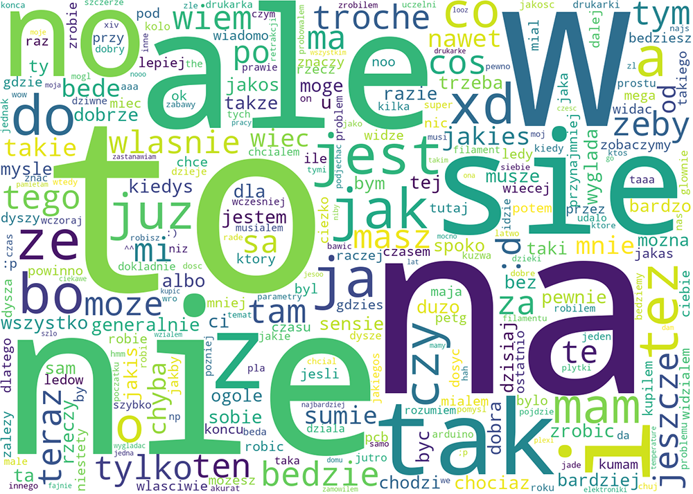
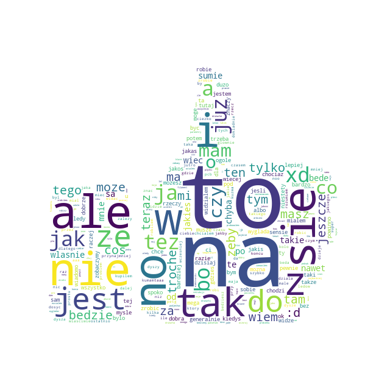
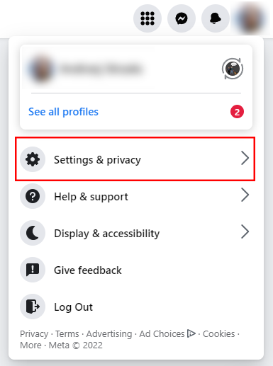
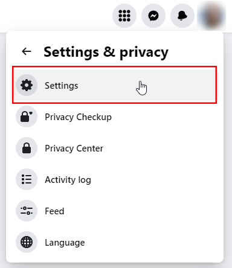
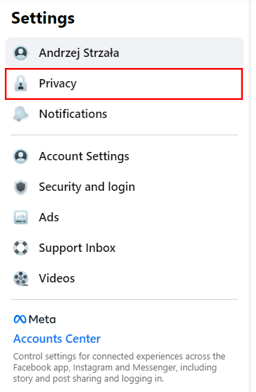
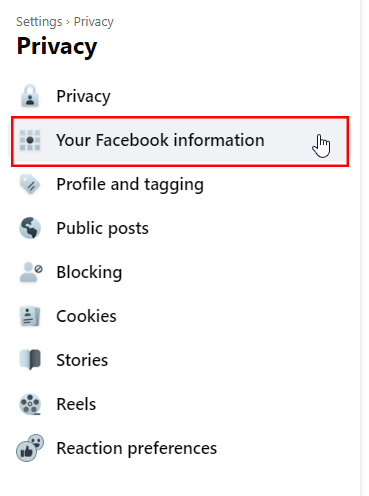
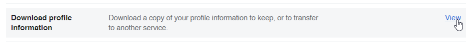
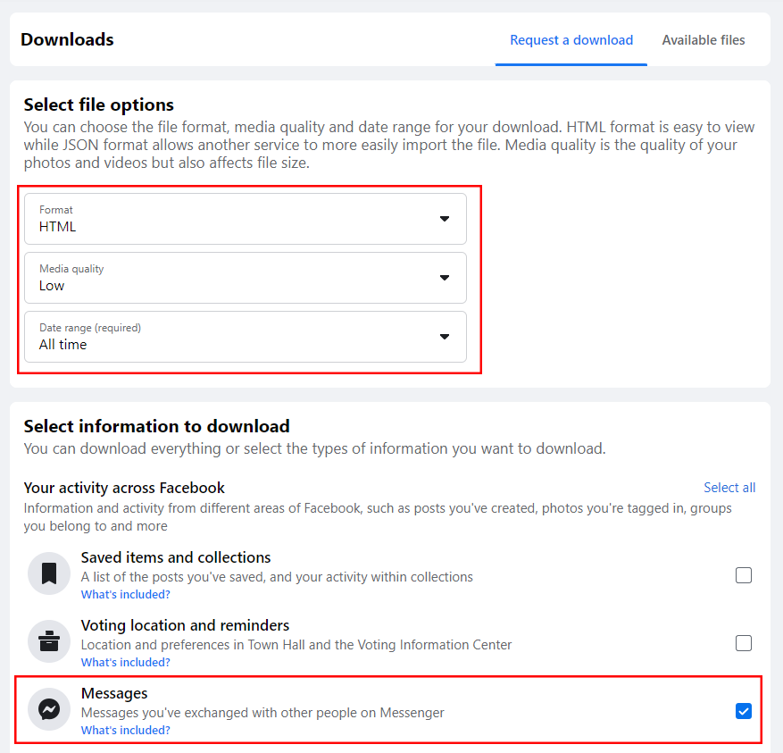
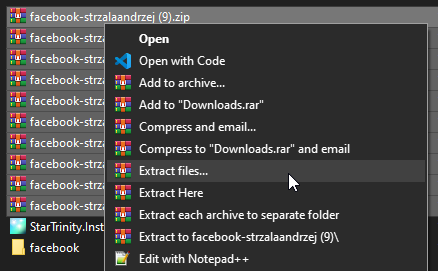
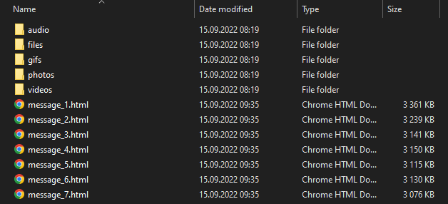

# Facebook Messenger Word Cloud
Create Facebook Messenger Word Cloud based on the messeges exported from Facebook archive. Script extracts messages from one or multiple "message_x.HTML" files for a selected folder and transform into **.PNG** (Word Cloud) and **.CSV** (descending words list) containing most frequently used words.
If you don't have any of the imported library, you can easily install them by coping the comment from the begining of the script (pip install XXX). Generating a word cloud from a JSON file would probably be much simpler however, not everyone downloads this file as an archive at the first place and it wouldn't be such a challenge.

## Table of contents
* [Example Usage](#Example-Usage)
* [Custom shape](#Custom-shape)
* [Downloading messages files](#Downloading-messages-files)
* [License](#License)

## Example Usage
Generate rectangular Word Cloud just providing the folder path containing the .html files:
```py
fb_word_cloud.py -p C:\Users\Andrzej\facebook\messages\inbox\username_xzdsmlmbaiw\
```




Generate rectangular Word Cloud without specified words:
> fb_word_cloud.py -p C:\Users\Andrzej\facebook\messages\inbox\username\ -e a,in,an,or,and,no,how,why 

Generate Word Cloud in different shapes (see [Custom shape](#Custom-shape) ):
> fb_word_cloud.py -p C:\Users\Andrzej\facebook\messages\inbox\username\ -e a,in,an,or,and,no,how,why -i C:\Users\Andrzej\Desktop\like.jpg
	
## Custom shape
In order to create Word Cloud in various shapes, mask need to be provided in in a certain way. Script accepts only files with .jpg, .jpeg and .png extensions. Additionally, file need to have black `#000000` shape and white `#FFFFFF` background. For .png files background can be transparent.
<p float="left">
     </img>
  
</p>

## Downloading messages files
If you don't know how to download facebook archive, below you can find step by step manual.

Click on you profile picture and select **Setting & Privacy** ⮕ **Settings**
<p float="left">
    ⮕  </img>
  
</p>

On the left side of the screen click **Privacy** tab and then **Your Facebook information**
<p float="left">
    ⮕  </img>
  
</p>

You will have a list of options to choose from, please select **Download profile information**



Here you can request a download of your facebook archive. It can contain all the information that Facebook has collected so far. We only need a message, so I checked only this option with low resolution images. Remember to select HTML format as below. Confirm your choices and wait until Facebook will generate files to download. It could take even 24h so be patient.



### Extracting files
After you download all the files created by Facebook, extract them to one folder. If your file archiver software recognise the same names in folders, just select "Rename All".



Ultimately, you should end up with following files when looking into selected person directory (eg.: ..\messages\inbox\username_xzdsmlmbaiw\)



## License

Copyright © 2022, [Andrzej Strzala](https://www.linkedin.com/in/andrzejstrzala/).
